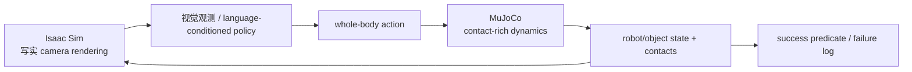

## 1. Benchmark 卡片：它在考“看、走、拿、放”的联合闭环

[SIMPLE](https://psi-lab.ai/SIMPLE/)（Simulation-Based Policy Learning and Evaluation for Humanoid Loco-manipulation）是一个面向 humanoid policy learning/evaluation 的公开 testbed。项目页/论文报告：**60 项全身任务、50 个 indoor scenes、1,000+ object assets**；它将 MuJoCo 的 contact-rich dynamics 与 Isaac Sim 的 photorealistic rendering 结合，并已整合多类 imitation network、VLA 和 WAM 进行比较。[论文](https://arxiv.org/abs/2606.08278)[官方代码](https://github.com/physical-superintelligence-lab/SIMPLE)

它测的不是“模型能否在一张图上预测动作”，而是：机器人看到场景、理解目标、走到物体旁、协调双腿/躯干/手臂完成操作，并在接触中保持稳定。例如：从房间一侧走到柜子旁、打开/取出/放置物体，或者在不同场景中搬运对象；每一步错误都可能使最终 episode 失败。

## 2. 随 benchmark 提供的资产与数据类型

| 层 | 具体内容 | 产生/存储位置（以 release 为准） | 对评测的作用 |
|---|---|---|---|
| task/scene assets | 50 indoor scenes、1,000+ object assets、机器人/环境配置 | 官方 repo 的 `assets/`、`data/` 与 task/config 目录 | 固定可见物体、初始布局、碰撞与可渲染对象 |
| physics state | robot root/joint state、object pose/velocity、contact、scene state | MuJoCo step 运行时 | state policy/oracle 与 task success 检查 |
| vision | 由 Isaac Sim 渲染的相机观测；可能含 RGB/RGB-D/任务所需视觉流，实际字段依 config | rendering pipeline | VLA/WAM 的视觉输入；与 state oracle 分开评测 |
| language/task condition | 任务描述、目标对象/区域和任务 config | task definition/benchmark API | 明确机器人要完成的行为 |
| control/action | humanoid 全身控制命令、低层 controller/AMO/SONIC 接口 | policy adapter / simulator loop | 定义 action frequency、chunk 与控制语义 |
| generated demonstrations | motion-planning 自动轨迹 + low-latency VR teleoperation 数据 | 两条官方 data generation pipeline | imitation/VLA training；不可与 test episode 泄漏 |
| evaluator log | success、失败原因、物体/robot trajectory、rendered video | benchmark runner | 逐任务统计和 failure analysis |

仓库顶层可见 `assets/`、`data/`、`docs/`、`examples/`、`scripts/`、`src/simple/`、Dockerfile、`pyproject.toml` 与 `uv.lock`。这说明它不仅是论文网页：可据 release 的 README/脚本实际安装；但具体 object license、每个任务的完整 observation schema 必须随所用 commit 读取 config，而不是从任务数量推断。

## 3. 双模拟器为什么会影响评测

SIMPLE 的设计把两个角色分开：

因此一条 episode 必须校验 MuJoCo 与 Isaac Sim 之间的 robot pose、object pose、camera extrinsics、时间步和坐标系同步。若视觉来自一个场景状态、物理执行来自另一个状态，VLA 的失败可能是桥接错误而非算法错误。

## 4. 输入 → 输出 → 判分：一个具象任务回合

| 阶段 | 输入 | 输出 | evaluator 关心什么 |
|---|---|---|---|
| reset | task ID、scene/object layout、robot initial pose、seed | 同步的 physics/render state、task goal | 测试布局是否属于 IID 或对象/场景/指令 OOD |
| observe | camera stream + proprioception；可加 language objective | policy context | 图像时间戳、相机标定、是否偷用 object GT state |
| act | policy 预测的 whole-body action / action chunk | joint/base/hand controller target | action semantics、Hz、latency、clip 与 safety limits |
| step | MuJoCo contact dynamics + Isaac Sim rendering refresh | new state/contact/visual observation | 是否跌倒、碰撞、物体掉落或越界 |
| score | trajectory、task predicate、episode log | task success/failure、时长、失败类别 | 任务是否最终完成，不只 action loss 是否低 |

例如“走到目标物体并搬运到指定位置”：success 至少要求机器人接近正确对象、建立足够稳定的手—物接触、将对象带到目标区域且未因跌倒或非法碰撞提前终止。只把手移动到对象附近、或在物体未离开原位时 episode 用尽，都不是完整成功。

## 5. 评测标准：最低报告口径

官方论文强调 simulation-to-real performance correlation 和对多类 policy 的规模化 benchmark。复现实验至少按如下维度汇报：

- **主分数**：逐任务 closed-loop success rate；再按 locomotion、manipulation、loco-manipulation 和长时程组合汇总。
- **泛化**：IID 与 object、scene、layout、指令、相机/视觉外观 OOD 分开给分；不可把两者合并。
- **物理安全**：fall rate、foot slip、object drop、非预期身体碰撞、contact force/joint limit violation、episode duration、action jerk/energy。
- **模型条件**：相同 camera stream、instruction template、context length、action representation、controller、rollout budget、预训练数据和 finetune 数据量。否则 VLA/WAM/模仿策略分数不可比。
- **数据生成消融**：motion-planning data、VR teleoperation data、真实/合成数据、仅视觉/仅 state、不同 scene split 分开比较。

## 6. 数据集怎样与 SIMPLE 关联

SIMPLE 自己含 task/scene assets 及两条 demonstration 生成 pipeline；外部数据集在此的角色必须单列：

| 外部数据 | 合理角色 | 不可替代的 benchmark 部分 |
|---|---|---|
| Open X / RH20T | VLA/操作表征的上游预训练 | SIMPLE humanoid action decoder 与目标任务 closed-loop success |
| GRAB / OMOMO | human-object contact、搬运/重定向先验 | 目标 robot 的稳定抓取、足部支撑与最终放置 |
| BEHAVE / H2O / EgoBody | 视觉/手—物感知前端 | Isaac Sim 场景中策略的实时视觉闭环 |
| AMASS / HumanML3D | 步态、动作/语言先验 | 有物体接触的移动操作成功 |

任何外部数据训练都应在 manifest 中证明未复用 SIMPLE test 的 scene/object/layout/task demonstration；最终分数仍由 SIMPLE 的 episode evaluator 计算。

## 7. 安装、访问与边界

官方仓库提供 `pyproject.toml`、`uv.lock`、Dockerfile、docker-compose、`Makefile`/`make.bat`、examples 与 scripts；优先按其当前 README 的 lockfile/容器路径部署，而不是从论文手动拼依赖。仓库自述建立在 AMO/SONIC 上，并整合 Ψ0、π0.5、GR00T、DreamZero、Cosmos3 等路线；这表示多个 policy adapter 已存在，**不表示所有模型在每个 task 上公平可比**。

SIMPLE 是目前四个 benchmark 中任务/场景规模最大的候选之一，但仍是近期项目。发布结果时必须锁定 commit、asset bundle、MuJoCo/Isaac Sim version、数据生成版本和 evaluator；并用独立真机协议验证 sim-to-real，不把仿真 success 写成硬件成功。
