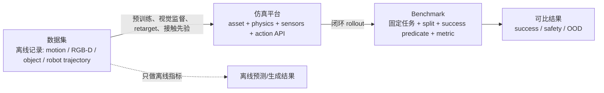

## 图例：先看证据等级

- **D（直接）**：官方代码/论文明确把左侧实体作为右侧实体的运行环境、训练源或评测协议。
- **E（外部使用）**：命名的公开工作明确使用该组合，但并非该左侧项目官方必备组成。
- **C（兼容）**：格式/接口上可接入或本文建议的实验设计；没有公开证据证明该具体工作已经使用。**C 不能用于宣称已有结果。**
- `—`：无可靠关联或不适用。

## 1. 概念边界

数据集本身一般没有要求策略在物理世界完成任务的 `success predicate`；benchmark 必须有。平台能运行 rollout，但若没有固定的 task/split/evaluator，它不是 benchmark。

## 2. 仿真平台 × 代表工作

| 平台 | HumanoidBench (2024) | Isaac Lab G1 locomanipulation workflow | ASAP (2025) | ManiSkill 3 (2025) | InternUtopia / GRBench | 证据说明 |
|---|---:|---:|---:|---:|---:|---|
| MuJoCo/MJX | D | — | E | — | — | HumanoidBench 官方代码以 MuJoCo/MJX 提供环境和低层技能训练。 |
| Isaac Lab / Isaac Sim | — | D | E | — | E | 官方文档给出 G1/GR-1 数据生成与 locomanipulation；ASAP/InternUtopia 的具体 backend 以各项目配置为准。 |
| Genesis World | — | — | — | — | — | 可部署平台；本表没有收录到与这些代表工作的直接证据。 |
| SAPIEN / ManiSkill | — | — | — | D | — | ManiSkill 官方是基于 SAPIEN 的 GPU 并行仿真/benchmark。 |
| InternUtopia | — | — | — | — | D | 官方文档提供 GRBench 的导航与移动操作 baseline。 |

## 3. 仿真平台 × 数据集（严格区分“已用”与“可接入”）

| 平台 | AMASS | GRAB | BEHAVE | OMOMO | HumanML3D | Open X / RH20T | 解释 |
|---|---:|---:|---:|---:|---:|---:|---|
| MuJoCo/MJX | E | C | C | C | C | C | 运动数据可经 retarget 驱动 MJCF humanoid；HumanoidBench 已显示 MJX 低层 skill 路径。 |
| Isaac Lab | E | C | C | C | C | C | 官方 humanoid 文档展示 human demo/Mimic 数据生成；各公开数据集需用户自行 converter。 |
| Genesis World | C | C | C | C | C | C | 引擎可载入自定义 asset/trajectory；未把兼容性写成已发表使用。 |
| ManiSkill/SAPIEN | C | C | C | C | C | C | 主要是 manipulation 平台；全身 retarget/足接触需自建。 |
| InternUtopia | C | C | C | C | C | C | 场景平台可接上数据训练的 policy；无公开逐数据集官方绑定。 |

## 4. 数据集 × Benchmark

| 数据集 | HumanoidBench | Mimicking-Bench | LeVERB-Bench | SIMPLE | 关联含义 |
|---|---:|---:|---:|---:|---|
| AMASS | C | E | E | C | 全身动作/retarget 先验；不是 benchmark 的最终 test label。 |
| GRAB | C | C | C | C | 手—物接触、全身抓取和 object geometry 先验。 |
| BEHAVE | C | C | C | C | RGB-D/人—物视觉前端与场景重放；非 robot action。 |
| OMOMO | C | E | C | C | 大物体全身动作与 object trajectory 条件。 |
| HumanML3D | C | C | E | C | 语言—动作前端/语义 motion prior。 |
| H2O / EgoBody | C | C | C | C | 视觉/手—物/ego 感知迁移；需单列 oracle gap。 |
| RH20T / Open X | C | C | C | E | 跨本体操作/VLA 预训练；目标 humanoid benchmark 必须重新 closed-loop 测试。 |

## 5. 数据集 × 代表工作

| 数据集 | 代表工作 | 使用方式 | 所得指标层 |
|---|---|---|---|
| GRAB | GrabNet | object shape 条件的手抓取生成 | 手姿态/接触/生成质量；不是 robot task success |
| BEHAVE | BEHAVE tracking | 多视角 RGB-D 联合人体—物体跟踪 | 人/物 3D 重建与接触；不是控制 |
| OMOMO | OMOMO | object motion → full-body human motion | 未见物体/运动下的 motion/contact 质量 |
| AMASS | Human2Humanoid / motion imitation 系列 | 人类 MoCap 重定向到 humanoid reference | tracking、稳定性、sim-to-real；按论文任务而定 |
| HumanML3D | T2M / motion diffusion 系列 | text → 3D human motion | FID、R-precision、多样性；不含物体成功 |
| EgoBody | EgoBody pose/mesh estimation 工作 | ego/multi-view 人体姿态与形状恢复 | pose/mesh/scene 泛化 |
| RH20T | RH20T one-shot learning | 人类 demo + robot visual/force/audio/action | one-shot manipulation 与多模态策略 |
| Open X | RT-1-X / RT-2-X | 统一 RLDS 的跨本体数据预训练 | 跨机器人/新技能 transfer；非双足 humanoid 原生 |

## 6. Benchmark × 能力轴 × 可比边界

这一张表是给读者做选型用的：**“高”只表示该 benchmark 的任务协议确实覆盖该轴，不表示它在其它轴上也有同等证据。**“迁移”表示可以作为补充实验或适配起点，不能与原生 benchmark 分数直接横排。

| Benchmark | 主要能力轴 | 原生 embodiment / 仿真 | 结果最小单位 | 与双足全身结论的距离 |
|---|---|---|---|---|
| HumanoidBench | locomotion、平衡、whole-body manipulation | humanoid；MuJoCo/MJX | 每任务 closed-loop success / return | 近：可作为核心控制对照 |
| Mimicking-Bench | human-to-humanoid、接触与场景交互 | humanoid；官方任务协议 | 每任务 success + tracking/contact | 近：强调重定向与交互几何 |
| LeVERB-Bench | vision-language WBC | humanoid；论文/项目协议 | 每任务语言条件 success | 近：需核对 runner、资产与版本 |
| SIMPLE | VLA 全身移动操作、sim-to-real | humanoid；MuJoCo + Isaac Sim（项目报告） | task/scene/instruction success | 近：规模大但版本与复现要求高 |
| LIBERO / LIBERO-plus | 桌面操作、终身学习、zero-shot 鲁棒性 | Franka/桌面；MuJoCo/robosuite | 每任务 success；ASR/BWT/F | 远：操作迁移诊断，不测双足 |
| CALVIN | 语言条件长程 chain | Franka；仿真环境 | MTLC / LH-MTLC | 远：长程语言操作，不测行走 |
| RoboTwin 2.0 | 双臂任务与 clean→random 泛化 | Aloha-AgileX；SAPIEN | 每任务 clean/random success | 远：双臂操作，非双足 |
| RoboCasa / BEHAVIOR-1K | 厨房/家庭多对象长程活动 | Panda/家庭 agent；程序化场景 | atomic/composite 或 activity predicate | 中远：场景迁移价值高，需自建全身接口 |
| SimplerEnv | real-to-sim 视觉匹配与排序相关性 | ManiSkill/SAPIEN | success + sim/real correlation | 迁移：不是独立 humanoid 榜单 |
| Habitat-Lab | 导航、重排、社会交互 | Habitat-Sim；PointNav/ObjectNav/Rearrange 配置 | success、SPL 或 task predicate | 迁移：补空间/社会能力，双足需自建接口 |
| ManiSkill | 高吞吐通用操作、跨本体消融 | SAPIEN；GPU 并行多机器人环境 | per-task success、效率、sim2real | 迁移：可承载 humanoid，但 task/evaluator 需冻结 |
| SPARK | 安全约束与任务性能权衡 | 可配置 humanoid 控制任务 | performance + violation/safety log | 近但单轴：不能替代任务泛化 |

**读表规则：**同一行内可以比较方法；跨行比较前，必须同时对齐 embodiment、任务集合、观测、动作接口、成功判定和统计聚合。只要其中一项不一致，就应写成“迁移实验”或“补充诊断”，而不是统一排名。

## 使用这五张矩阵的规则

1. 选一个 **Benchmark** 来限定最终结论；
2. 选一个可部署 **平台** 来运行相同 robot/scene/action protocol；
3. 选数据集时只按矩阵中标注的角色使用，并建立去泄漏 manifest；
4. 论文中的每条箭头应有 D/E 级来源或明确标 C（本文建议），不能把 C 写成先前工作事实。
