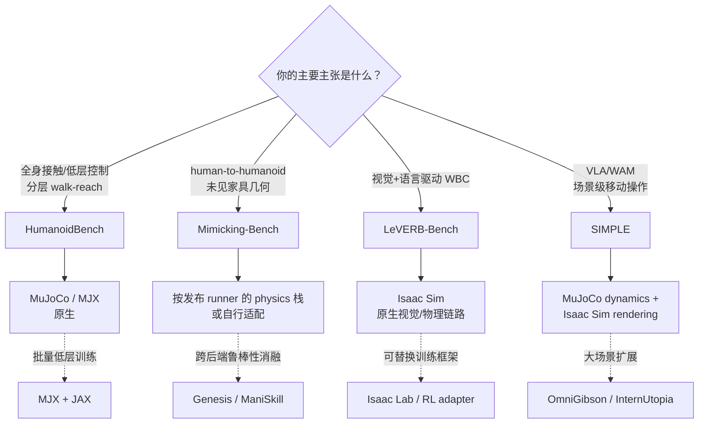

## 1. 先定义“适配”

这里的“仿真方法”指能让算法在虚拟机器人上执行的技术栈：物理后端、批量训练后端、视觉渲染后端和 robot action adapter。它不等于训练算法（PPO、VLA、WAM）本身。

| 标记 | 含义 | 可以如何表述 |
|---|---|---|
| **N：原生底座** | benchmark 官方代码/论文明确把该后端作为核心运行组件 | “HumanoidBench 原生运行在 MuJoCo 上” |
| **D：直接复现** | 公开的 benchmark runner 或官方任务工作流可在此栈直接执行 | “按官方安装/配置可复现实验” |
| **A：需适配** | 能力上可承载，但需自行迁移 asset、observation、action 和 evaluator | “可移植到 Isaac Lab，但不能称官方复现” |
| **—：不建议作主结果** | 缺少关键能力或没有可信 runner；只能用于辅助消融 | “可做局部原型，不作为该 benchmark 的主分数” |

## 2. 仿真方法—Benchmark 主适配矩阵

| 仿真方法 / 栈 | HumanoidBench | Mimicking-Bench | LeVERB-Bench | SIMPLE | 适配原因与迁移成本 |
|---|---:|---:|---:|---:|---|
| **MuJoCo（经典 CPU/GPU）** | **N** | A | — | **N**（动力学侧） | HumanoidBench 官方环境使用 MuJoCo；SIMPLE 明确用 MuJoCo 做接触动力学。迁移 Mimicking-Bench 需要重建 humanoid/scene/contact 与其 success predicate。 |
| **MuJoCo MJX + JAX** | **D**（低层批量训练） | A | — | A | HumanoidBench 官方仓库含 `mjx/` 与低层技能训练路径。MJX 提供吞吐，但不能自动复用视觉/任务 evaluator。 |
| **Isaac Sim + Isaac Lab** | A | A | **N**（视觉/物理链路） | **N**（渲染侧） | LeVERB 的合成 visual pipeline 用 Isaac Sim；SIMPLE 用 Isaac Sim 做写实渲染。迁移 HumanoidBench/Mimicking-Bench 要重新验证 physics 差异，结果不能与原榜单混列。 |
| **Isaac Lab manager-based env + RL 栈** | A | A | A | A | 适合把任务资产包装成 vectorized Gym 环境、接 PPO/RSL-RL/VLA adapter；但本页原有四个全身 benchmark 的 success predicate、随机化和 split 仍必须原样实现。 |
| **Genesis World** | A | A | A | A | 可以加载自定义 humanoid/scene、跑 physics/sensor/action loop；没有本页原有四个全身 benchmark 的官方 runner。适合原型或 cross-simulator robustness，不可直接报“官方 benchmark 分数”。 |
| **SAPIEN + ManiSkill** | A（操作子任务） | A | A | A（操作子任务） | GPU 并行 manipulation 很适合手—物消融；但双足落足、whole-body balance、原 task assets 与 evaluator 均需自建。 |
| **OmniGibson / BEHAVIOR** | — | A（家庭场景概念） | A（视觉场景） | A（家庭场景） | 适合扩展家居场景/对象状态，但并非本页原有四个全身 benchmark 的原始 robot、物理或 task runner。 |
| **InternUtopia** | — | A（场景泛化） | A（视觉/导航） | A（大场景） | 提供大场景导航/移动操作基础设施；要变成双足 humanoid benchmark，必须自建 full-body asset、落足/跌倒规则和 evaluator。 |

### 新补充 benchmark 的适配结论

| Benchmark | 原生/直接栈 | 哪些栈可做适配 | 适配时最容易丢失的评价能力 |
|---|---|---|---|
| SMPLOlympics | 官方 Isaac Gym + SMPL/SMPL-X 模型路径 | MuJoCo、Isaac Lab、Genesis | 体育道具接触、对手逻辑、sport-specific score 与 motion-prior 对齐 |
| SPARK | 官方 toolkit 所选 simulation/hardware modules | Isaac Lab/MuJoCo 等可作为 nominal policy backend | safety constraint、risk log、filter latency 与 task performance 的同步统计 |
| BiGym | 官方 BiGym runner | Isaac Lab/ManiSkill 可重实现家居移动双臂任务 | 人类 demo、三相机 RGB-D、移动本体 action 和 40 task predicate |
| MS-HAB | ManiSkill3 `mshab` branch | Isaac Lab/OmniGibson 可重实现家居重排 | realistic low-level grasp、2×RGB-D、subtask safety threshold、长时程 task graph |

## 3. 一眼看懂的选择图

## 4. 按算法类型选择适配方法

| 你的算法形态 | 最小可行仿真方法 | 首选 benchmark | 输入/输出必须对齐的地方 | 不能省略的对照 |
|---|---|---|---|---|
| 低层 RL / MPC / motion imitation | MuJoCo；大批量可用 MJX | HumanoidBench | `qpos/qvel`、actuator order、PD/torque mode、timestep | no-skill vs pretrained walk/reach；state vs tactile/vision |
| human-motion retarget + tracking | 与 benchmark 发布 runner 相同；必要时 MuJoCo/Isaac Lab 自建 | Mimicking-Bench | human skeleton→robot joint map、root scale、foot contact、scene mesh | seen vs unseen geometry；tracking vs task success |
| VLA / vision-language high level | Isaac Sim/Isaac Lab camera pipeline | LeVERB-Bench | RGB camera pose/FPS/delay、language template、latent/WBC adapter | image vs privileged state；with vs without language |
| VLA/WAM action chunk | SIMPLE 双后端或严格同步复现 | SIMPLE | render/physics timestamp、action chunk、controller、scene/object state bridge | target-only vs dataset-pretrain；IID vs scene/object/instruction OOD |
| 手部 manipulation policy | ManiSkill/SAPIEN 可先做局部单元测试 | HumanoidBench/SIMPLE 的操作子任务 | hand DOF、grasp controller、object mass/friction | 在目标全身 benchmark 再测 fall/drop；不能只报桌面成功 |

## 5. “适配”真正需要实现的 6 个接口

把一个 benchmark 从原生后端移到 A 类仿真方法时，下面 6 项必须全部完成；缺一项就不是等价 benchmark。

1. **Asset adapter**：robot XML/USD/URDF、手部、object mesh、collision、mass、friction、joint limit 一致或有明确差异表。
2. **Observation adapter**：state/RGB/tactile/language 的字段、坐标、时间戳、分辨率、噪声和延迟一致。
3. **Action adapter**：把 policy 输出映射到相同关节顺序、控制模式、clip、control Hz 和 action chunk。
4. **Reset/split adapter**：复刻初始状态、scene/object/geometry IID/OOD split 和 random seed。
5. **Success adapter**：将原 `success predicate`、failure termination、horizon 逐字实现；不能以新 reward 阈值代替。
6. **Log adapter**：逐 episode 输出 success、return、fall、drop、collision、duration、state/action trace 和视频，保证可逐回合比对。

## 6. 最终报告的命名规则

- 用 N/D 栈得到的分数：可以写“在 **官方/直接复现的** HumanoidBench、LeVERB-Bench 或 SIMPLE 协议上”。
- 用 A 栈得到的分数：应写“**HumanoidBench-inspired / reimplemented protocol on Isaac Lab**”，并公开差异表；不可与原始 leaderboard 混排。
- 用 — 栈做局部实验：只能写“manipulation/scene stress test”，不能称为全身 benchmark 结果。

该图与[关系矩阵](../relationship-matrices/)互补：本页回答“哪种仿真方法适合跑哪个 benchmark”，关系矩阵回答“数据集、工作和 benchmark 是否有直接证据关联”。
